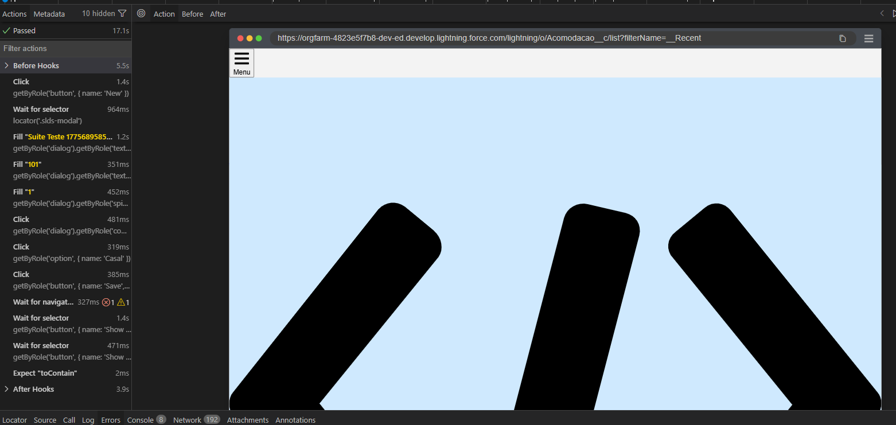

# Documentação de Erro: Falha de Renderização do Salesforce no Playwright Trace Viewer

## Resumo

Ao visualizar a execução de testes no Salesforce através do modo UI do Playwright (Trace Viewer), a interface gráfica falha ao carregar corretamente, apresentando elementos visuais desproporcionais que cobrem a tela, acompanhados de erros de rede no console do visualizador.

**Importante:** Este é um artefato visual do Trace Viewer e não afeta a execução ou o resultado do teste automatizado (o teste é concluído com sucesso).

## Sintomas

- **Visuais:** Aparição de formas vetoriais pretas gigantes (como triângulos ou faixas) que preenchem quase todo o espaço útil da janela do navegador simulado.
- **Console/Rede:** Falhas de requisição geradas pelo Service Worker do Playwright (`sw.bundle.js`) ao tentar reconstruir a página a partir do arquivo de trace:
  - `Failed to load resource: the server responded with a status of 404 ()`
  - `The FetchEvent [...] resulted in a network error response: the promise was rejected.`
  - `Uncaught (in promise) TypeError: Failed to fetch`

## Causa Raiz

O erro ocorre devido a uma dessincronização entre a forma como o Salesforce Lightning Design System (SLDS) constrói sua interface e como o Playwright captura os snapshots do DOM.

1. **A Natureza dos Elementos SVG no Salesforce:**
   O Salesforce utiliza SVGs (Scalable Vector Graphics) para renderizar a grande maioria dos seus ícones e detalhes de interface. Por padrão, um elemento SVG sem restrições tentará expandir para preencher 100% do seu contêiner. O que mantém esses ícones do tamanho correto na aplicação real são as classes CSS carregadas pelo sistema.

2. **A Falha de Captura (Erro 404 e Fetch):**
   O Playwright Trace Viewer não grava um vídeo em MP4, mas sim tira "fotografias" do código HTML e tenta recarregar os arquivos CSS e de imagem salvos no arquivo `trace.zip` localmente.
   - O Salesforce carrega muitos de seus recursos CSS dinamicamente. Frequentemente, a ação do Playwright (como um clique) é tão rápida que o snapshot do DOM é capturado _antes_ que o download dos estilos seja concluído e salvo no arquivo zip.
   - Além disso, as Políticas de Segurança de Conteúdo (CSP) rígidas do Salesforce muitas vezes bloqueiam o Service Worker do Playwright de buscar recursos remotos ou reconstruir a página localmente.

**Conclusão do Erro:** O Trace Viewer consegue remontar o HTML (por isso os cliques do teste funcionam), mas não encontra os arquivos CSS (gerando os erros `404` e `Failed to fetch`). Sem o CSS para ditar o tamanho correto, os SVGs da interface do Salesforce explodem de tamanho na tela do visualizador.
